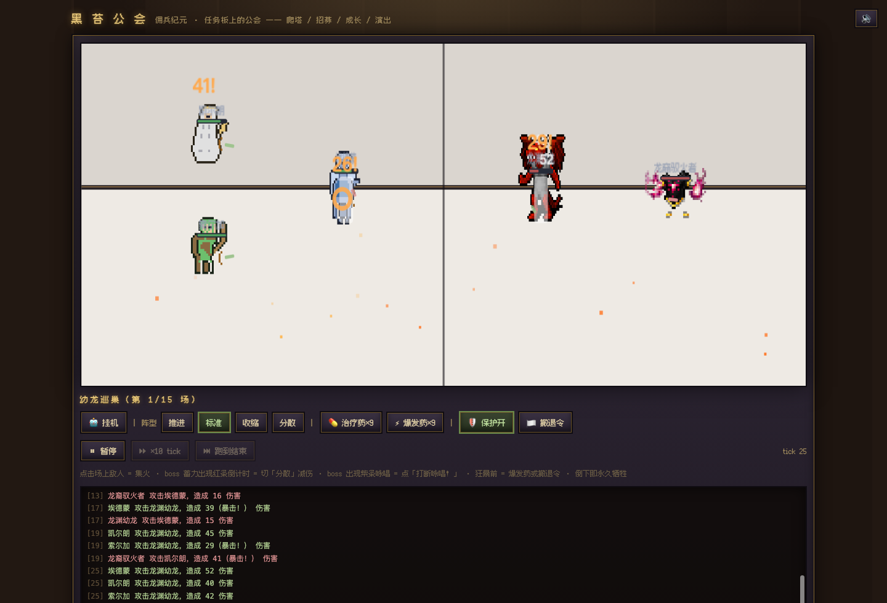

# 黑苔公会 · Guild of Blackmoss

> 英雄会死,故事不会。—— 一款像素风佣兵公会管理游戏

**▶ 在线试玩:https://eatmy6ss.github.io/guild-of-blackmoss/**

无需安装,浏览器打开即玩。存档保存在浏览器本地,游戏内可随时导出存档码备份。



## 这是个什么游戏

你是一间佣兵公会的队长:招募佣兵、接任务、下副本、活着带兄弟回来。

- **永久死亡**——战斗中倒下的佣兵永远离开,名字刻进纪念堂;团灭将失去整支远征队
- **逐段选路 + 熟练度迷雾**——副本内部路线固定,但未探索的节点只显示风味名;反复深入会逐渐揭示地图,练到满级可「直捣 boss」
- **指挥有感战斗**——阵型(推进/标准/收缩/分散)、集火、打断咏唱、药水时机;每个 boss 都有自己的机制考题
- **巫师 3 式事件**——91 个事件,每个选择都有取舍,部分后果延迟数天才显现
- **两片版图 12 座副本**——黑苔荒野 → 龙脊山脉(鳞音圣战),灼热地形、火抗套装、龙裔怪族
- **黑苔高塔**——无限爬塔,第 9 层起撤退保护失效
- **灵魂层**——士气、性格、默契、编年史:你的佣兵不是数值,是会恐惧也会忠诚的人

## 开发版运行

```bash
# Node.js 18+
npm install
npm run dev        # 开发服务器 http://localhost:5173
npm run build      # 生产构建 → dist/
npm run verify     # 全量门禁(构建+37 项冒烟断言+E2E 基建)
```

- 满配试玩档:`node scripts/dev-save.mjs [等级 1-15]` 生成导入码(docs/dev-save.txt)
- 单文件分发版:`npx vite build --config vite.config.playtest.ts` → dist-playtest/

## 技术栈

TypeScript · React · PixiJS · Vite · WebAudio(程序化音效) · Tauri(发行期封装,暂缓)

- 引擎/表现分离:模拟层(`src/sim/`)纯函数可独立测试,表现层只消费状态
- 37 项冒烟门禁 + CDP E2E(`scripts/e2e-*.mjs`)作为提交守卫
- 像素素材:[Dungeon Crawl Stone Soup tiles](https://opengameart.org/content/dungeon-crawl-32x32-tiles)(CC0)+ 程序化像素矩阵
- 字体:[Fusion Pixel 12px Proportional SC](https://github.com/TakWolf/fusion-pixel-font)

## 项目结构

```
src/
  sim/      纯逻辑层(战斗/远征/事件/经济/成长——全部可单测)
  data/     数据表(副本/怪物/boss/事件/装备/特质——加内容不动引擎)
  ui/       表现层(Pixi 战斗渲染器 + React 界面)
  state/    存档(v11 迁移链)
scripts/    门禁(smoke)/E2E(CDP)/探针(节奏·新档)/打包
docs/       设计文档(DESIGN.md 宪法/boss 提案流程/验收截图)
```

## 当前状态

内部开发版(M1+):两片版图 + 91 事件 + 事件延迟链 + 熟练度迷雾 + 灼热地形 + DCSS 素材管线。数值仍在迭代,欢迎试玩反馈:哪里爽、哪里难受、哪里看不懂。

## License

代码与原创内容归项目所有。像素素材含 CC0 公共领域成分(见上文来源),字体按其上游授权分发。

## 协作开发(Collaborators)

受邀协作者上手三步:

```bash
git clone https://github.com/Eatmy6ss/guild-of-blackmoss.git
cd guild-of-blackmoss
npm install && npm run dev   # http://localhost:5173
```

- push 需要认证:推荐安装 [gh CLI](https://cli.github.com/) 后 `gh auth login`,或配置 Personal Access Token
- 约定:改动先在本地验证 `npm run verify`(37 项门禁),绿了再 push
- 大改动建议开分支(`git switch -c feature/xxx`),小修可直接推 main
