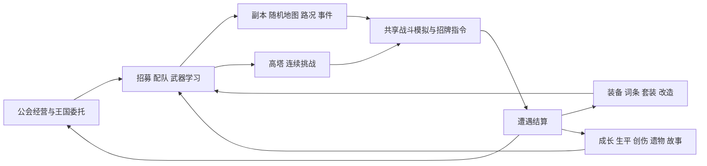

# 系统现状盘点（全景地图）

2026-10-07 校准，云端基线 `762690c`（存档 v30）。本轮本地修复与实际验收见 [HANDOFF](HANDOFF.md) 的 SYS-0/SYS-1 工单。本文记录当前实现和职责；任务进度看 [BACKLOG](BACKLOG.md)，已定规则看 [DECISIONS](DECISIONS.md)。旧版全景保留在 Git 历史，不作为当前缺陷清单。

## 当前阶段

批次 2 的 #2.1–#2.8 已有云端实现和出口登记；G2 外部试玩按 U37 并行招募，未据此宣布通过。G3 数值统调仍待制作人明确下令解冻 C4。历史测试数量不等于本轮实跑结果，当前验证记录统一在 HANDOFF。

## 玩法与系统关系

装备与职业影响战斗、路况影响风险和收益、死亡影响传承与故事，是保留的玩法联系。需优化的是重复规则、状态写入分散和结算时点混用。

| 系统 | 当前实现 | 主要职责与联系 |
|---|---|---|
| 公会与人物 | 招募、编队、六职业十二基础专精、混合职阶、等级、士气、默契、心愿、创伤和个人生平；试玩隐藏混合职阶 | 人物参与战斗；升级、阵亡、首杀等形成生平及事实 |
| 武器 | 刃、弓、杖圣器、锤斧、长柄五族；按人学习，学习期间不可出征；职业施法能力独立于武器熟练 | 武器决定攻击方式、站位及依赖该族的技能能否使用；跨职业穿戴保留 |
| 副本 | 两版图、随机分层节点、熟练度渐进揭示、暗道、地形回报及路况双刃效果；双 Boss 变体 | 低熟练度未探索选项全为 ❓；35/60/80 逐步看清近处到全图，已走路线保留。路线连接仍可见可选，旧直达 Boss 描述已过期 |
| 战斗 | 普通技能、12 专精招牌技、仇恨、武器效果、机制读条与打断、暂停、1/2/3 倍速、挂机指挥 | 普通伤害按武器规则累计破条；打断类招牌技另有强制打断；技能以模拟 tick 计时 |
| 装备 | tier 化词条、15 项属性、灰冠/猎风现有套装、血债/背水/棘肤触发词条、倾向池 | 倾向池限制掉落分布，不限制穿戴；触发词条复用威能机制 |
| 装备操作 | 逐属性/行为差异对比、仓库过滤与锁定、批量分解、词条升档、品质提升 | 物品 UID 仓库管理归属；分解和改造接入金币/星髓，不另造一套物品模型 |
| 设施与情报 | 疗养降档及虚痕消退、重铸、遗物传承、替补跟操；情报 v2 条目、三档可靠度、货源与本趟侦察 | 情报提前揭示一档并提供怪物/首领资料，熟练度负责长期理解；公会日连接训练、恢复、补货及延迟事件 |
| 王国 | 委托进度与奖励、信任度、分档解锁的王国货架 | 出征与成长推进委托；领取、购买有可见结果 |
| 事件与叙事 | 城内/副本/地形分池、延迟后果、事实账本与说书人、公会大事记和个人生平分工 | 选择与战斗产生事实；叙事从事实中选取，不另造与实际行为冲突的故事 |
| 高塔 | 共享战斗、RunCore 与遭遇结算，保留独立层数和挑战规则 | 不参与副本情报验证；长期裂隙/终局设计仍按后续批次 |
| UI 与资源 | 独立页面状态、花名册嵌入档案、地图节点、终局结算弹层；Pixi 战斗与共享资源目录、音频 | 表现读取战斗状态/事件；旧本地 221 资源版本不等于当前 main 的资源库 |
| 管理员模式 | tools/admin 独立入口、独立进度，复用正式关卡、装备数据及战斗模拟 | 测试结果不写入正式公会存档 |

## 代码职责

| 位置 | 当前职责 | 优化方向 |
|---|---|---|
| src/data | 职业、装备、敌人、机制及世界内容表 | 保持内容定义与模拟规则可追溯 |
| src/sim | 战斗、远征、成长、结算与叙事计算；运行时不依赖 UI/存档 | 普通技能与招牌共享适用的规则；逐步整理 combat、AI、机制间循环引用 |
| src/sim/settlement.ts | 统一副本遭遇与塔层结果计算 | 保留纯计算入口，区分每场结果与本趟终局附加处理 |
| src/state/item-registry.ts | 物品身份、归属和装备视图 | 继续作为唯一物品归属依据 |
| src/state/save.ts | v30 序列化、读取与逐级迁移 | 内部重构不自动升级存档；持久化结构变动走迁移 |
| src/App.tsx + src/ui/controllers.ts | 页面装配、操作、推进、结果应用、保存衔接 | 按业务操作收紧依赖；不要把大量 setter 原样装进新外壳 |
| src/ui/battle + src/assets + src/audio | 画面、UI、资源及声音 | 不回写战斗规则；状态和效果显示与模拟一致 |

## 当前修复与后续缺口

- **SYS-1 本地完成**：修复非打断招牌强制破条、招牌冷却漏接；I8 改为相同人物/同基底的单变量行为检查，套装对照保留相同基础盘与威能。试玩发现的普通节点仅连隐藏暗道问题已补可见出口，新图与旧断点显示/选路一致。验收证据与局限见 HANDOFF。
- **SYS-2 本轮**：结算保留讲述水位/本趟起点/模板记忆；同趟碰撞不串旧远征，未讲过的延迟后果可引用旧选择。首杀与死亡统一用战斗序号；战斗终局/地图撤退共用故事入口。有效出发集中推进日期、到期处理与补货，并保留可见提示。情报验证仍挂在每场副本结算，等待 D1 的终局口径选择后迁入结束入口；不视为已修。
- **治疗覆盖仍有缺口**：#2.7 已接普通单体治疗、药水及环境修正；群疗、引导和招牌治疗仍需逐路径核对，不能把 computeHeal 的公式测试当成所有技能已经使用它的证明。
- **SYS-3 至 SYS-5 待做**：公共战斗操作、App/controller 接口、公会操作提交和 UI 状态读取。现有装备对比与 QoL 已落地，按真实缺口完善，不重新开发一遍。
- 长期经济、战斗节奏、假情报挫败感及真人理解度仍需 G2/G3 证据；代码交付不等于这些体验问题已解决。
- 2026-09-24 的 F/K/P 缺陷与提案状态应查 BACKLOG 历史及后续交付，不再整表列为当前未修复。现有套装、心愿、特性等已实现内容不能误归为“尚未开发”。

## 后续方向与协作

U08 的刷本成长主循环、U09 装备纪元融合、U10 高塔连续挑战、U11 纪念品质，以及 U27–U37 的改版方向继续有效。位阶完整版、裂隙终局和余震沙盒按后续工单推进；版图三、声望、10 人本、公会保卫战等仍在挂起池。新美术方向和新的玩法规则按当前用户指令及决策处理。

shldo 侧在最新 main 的独立分支交付；旧美术分支只作复检参考，不能整支合入。认领、验证、提交及云端状态写入 HANDOFF，制作人侧的 main 合并与部署流程不替代 shldo 分支约束。
