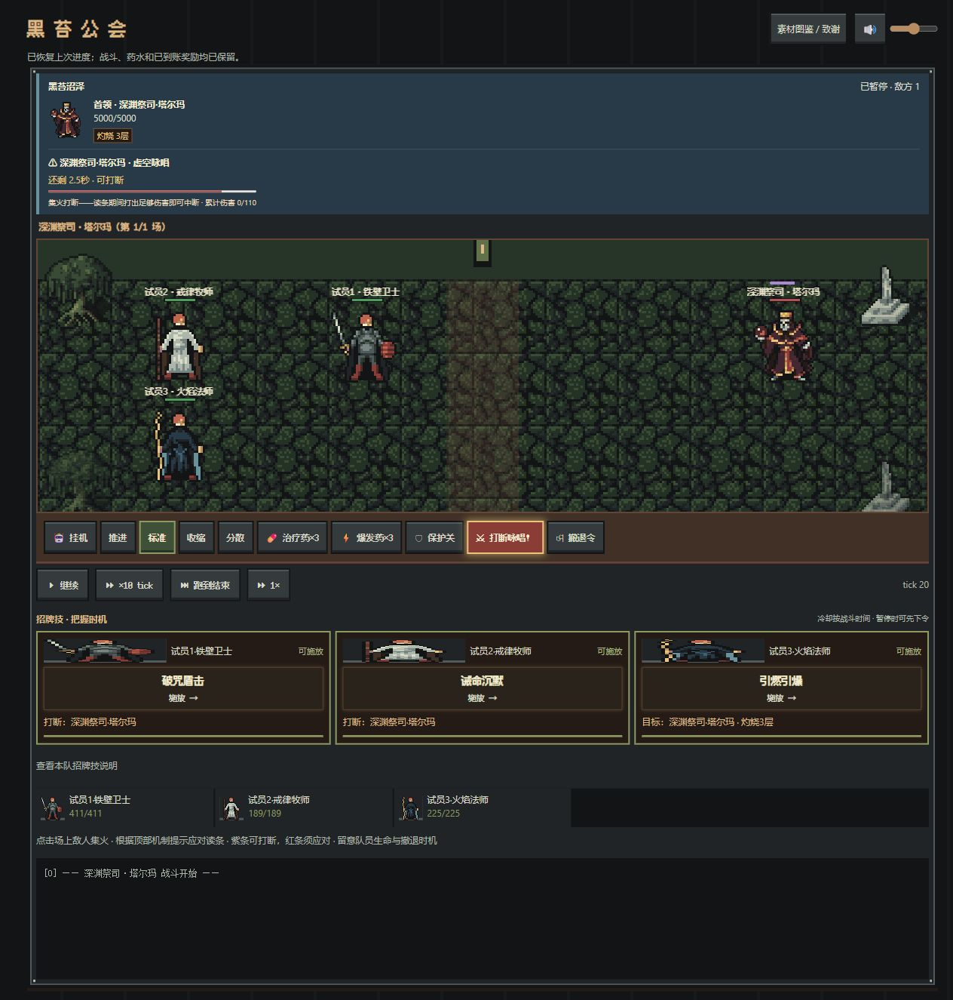
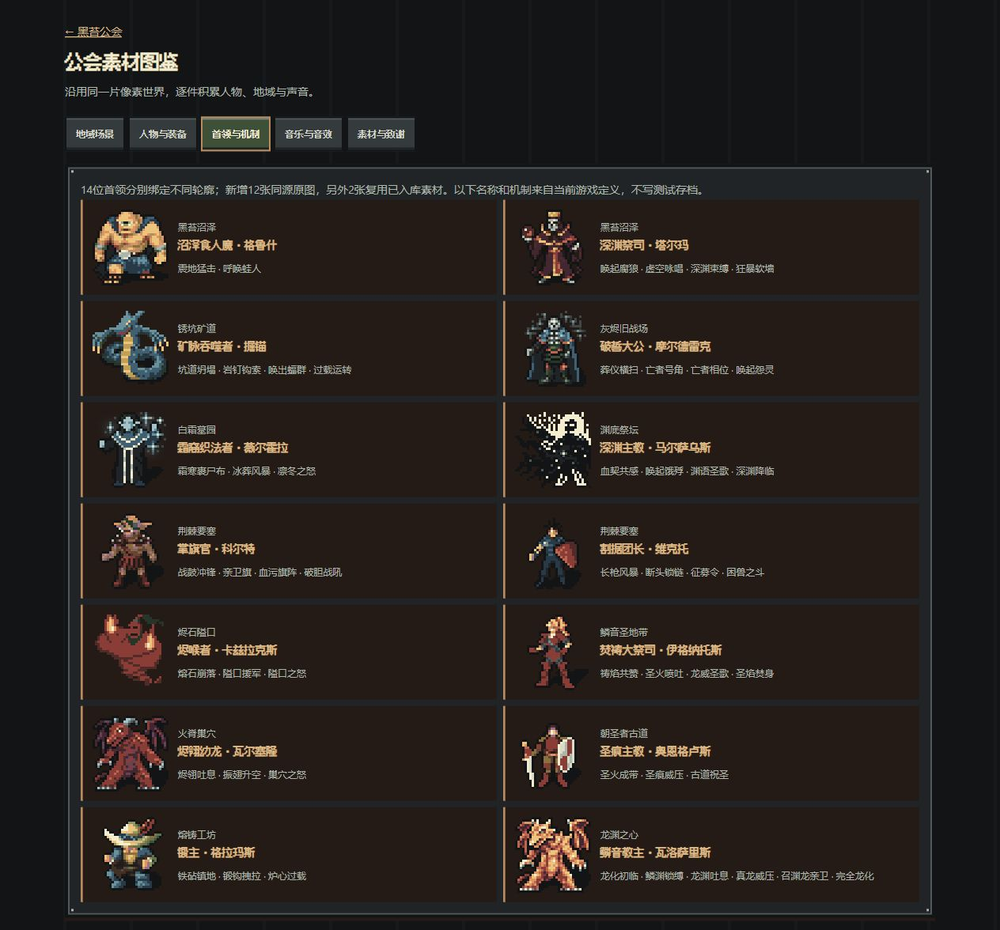

# 免费资源库与战斗反馈第二版（2026-10-02）

本轮先同步`origin/main@b5e9bc8`，从新分支`codex/art-battle-feedback`继续。PR #6已合并；云端新增的招牌技、账本、引导和试玩设置均保留，以其实际实现为新基线。仍沿像素奇幻、铁木框、布旗和文书语言，零采购，不恢复旧作战台。完整美术/音乐库继续逐轮积累，本轮没有新增音乐或玩法，也没有存档schema迁移。

## 阶段交付与验收分析

| 阶段 | 实际交付与验收 | 结果/修正方向 |
|---|---|---|
| 同步与复核 | main包含首轮代码，PR合并状态已核对；原D盘旧分支和WIP保持。基线verify97项通过；复审两份日报 | 已同步；叙事与导入问题单独记录，不能以门禁绿宣布G2已就绪 |
| 首领资源 | 14位首领绑定14张不同图，新增12张CC0原包PNG，另2张复用旧库；14个输出SHA不同，不与当前关键杂兵共图。图鉴与战场按同一稳定ID读取，名称/机制取实际游戏定义 | 已实装；改善轮廓和辨识，没有独有逐帧动作或龙化阶段切图，不冒称14套完整动画 |
| 战斗信息 | 人物头像/姓名、招牌技名、目标/层数、冷却、等待读条与阻止原因；暂停单条排队确认；圣疗点名按钮。说明折叠，避免窄屏堆满长描述 | 桌面按本队人数排卡，1000px以下两列、640px以下一列；320/390px无横向溢出，主要按钮≥44px。长屏仍须纵向滚动，真人理解测试未替代 |
| 机制/状态 | 同一只读解析器驱动DOM/Pixi剩余窗口；显示首领/集火者、血量、护盾/灼烧/束缚/易伤等实际状态；按注册表分别提示龙息与范围震地应对 | 暂停不消耗读条，2×自然随tick推进，中途刷新能还原；命中/碎条等短演出仍使用演出时间。相同单位并发多个机制时DOM逐项显示，Pixi显示最早到期条 |
| 装备/顶部 | 品质边框+纹饰形状+文字/语义标签，接入人物装备、仓库、图鉴；音量与致谢纳入顶部布局 | 普通/精良/史诗均实看；仓库变卖取消后3件与900金保留；致谢Esc关闭并返回入口。每件装备独有美术仍未完成 |
| 可靠性修正 | 非打断招牌技不再强制打断；新用户音量50%；暂停指令即时保存、有效指令才计数；高塔接入共同技能/提示；正式包剔除试玩终局弹层 | 均有回归/实际页面证据；正常累计伤害打断保留，不变数值表、奖励或v22存档结构 |

## 免费素材准入

新增图来自已锁定的[Dungeon Crawl 32×32 supplemental](https://opengameart.org/content/dungeon-crawl-32x32-tiles-supplemental)，该条目CC0声明与上游README致谢已核对。原包SHA256：`41b4dc79632be19c47bf4555fd61e949189bb4496771b72e2dec5715b2d7bab4`。仅逐件采用适合当前首领的32px图，保持原始字节；运行时沿既有统一色板管线显示，无AI改图、裁图或整组移植。

| 游戏ID | 对应角色/原包文件标识 |
|---|---|
| grush / talma | 格鲁什`polyphemus_new` / 塔尔玛`boris_new` |
| delveanchor / moldreke | 掘锚`lindwurm` / 摩尔德雷克`deathknight`，复用旧库 |
| velhola / malsau | 薇尔霍拉`fannar` / 马尔萨乌斯`ereshkigal_small` |
| colt / victor | 科尔特`urug_new` / 维克托`donald_new` |
| kazraxes / ignathos | 卡兹拉克斯`azrael` / 伊格纳托斯`margery_new` |
| valselon / oengus | 瓦尔塞隆`xtahua_new` / 奥恩格卢斯`norbert` |
| gramas / valosaris | 格拉玛斯`wiglaf_new` / 瓦洛萨里斯`golden_dragon` |

准确原包路径、作者、许可、原包/输出指纹和衍生说明在`public/assets/CREDITS.json`，沿用现有许可文件；本轮总计102张PNG、5首音乐、6个音效=113项实际资源。骨架/专精仍共用人物分层，不把品质边框称为新的武器立绘。

## 实际页面与打包证据

使用独立5497/5498，测试数据均为合成公会；未写5494等用户原页面的真实进度。首领展示样本调整HP/攻击间隔以保留窗口，不能据其判断关卡难度。高塔样本使用正常模拟和真实伤害。截图均来自实际运行页面。

- 副本3人：恢复中的塔尔玛咏唱；盾击排队禁用其他技能→立即刷新→tick21打断并产生护盾，冷却正常；火法引爆日志消耗3层。5人：献祭生命代价、圣疗点名、兽王召狼；320px按钮与战场容纳5人+召唤已测。后续校准说明折叠、卡数分列与按钮留白。
- 倍速：tick20/剩25进入2×，暂停到tick27/剩18；随后页面检查仍18。暂停和读档的DOM/Pixi条同步，不用实际等待毫秒推算机制窗口。
- 高塔：390px，tick0→10真实普攻/火法叠层；圣疗点名guard后立即刷新仍显示已下令；tick11释放，tick20显示冷却8.1秒，3张卡完整、无横向溢出，无控制台warn/error。
- 图鉴：14首领全部绘出，无降级占位，390px宽375=scrollWidth375；六职业装备预览可选择史诗纹饰和巨剑。人物页390px显示9个装备控件，白绿紫品质并存；仓库取消变卖不扣装备/增金。初次两张截图实际为桌面，已按真实尺寸改名，未冒称窄屏。
- 打包：最终正式构建与单文件试玩均成功；内嵌118项=113资源+清单/许可，逐字节核对，HTML约13.4MiB。5498首次仅HTML、无assets目录，试玩载入及素材显示正常，无warn/error；随后加入实际正式构建作同源隔离对照。试玩333金/第10日，正式900金/第8日未被试玩写入覆盖；正常包含两片版图。正式包最终不含试玩存档键或结束弹层文字。
- 自动验收：最终完整`npm run verify`实际退出0，23测试文件/109项Vitest、资源113、管理员类型、smoke47、玩法77、王国回归、生产类型/构建通过；差异格式检查通过。Windows下原四E2E/QA脚本的硬编码macOS浏览器未适配，本轮相关手动路径不冒称那五个脚本已通过。

截图与复现：[证据目录](evidence/art-battle-feedback-2026-10-02/)。桌面战斗与首领图鉴可对照：

## 接续

本轮代码/资源限定在App挂载/存档触发、ui/art、SignatureBar/只读解析、BattleRenderer、audio和招牌打断的一处条件，以及对应回归；`src/state`与`src/data`未改变。测试脚本补真实App存档effect回归。当前是本地下一版，未推送/开PR/合并/部署；具体提交见HANDOFF与Git。

下轮建议先处理[独立复审](cloud-review-2026-10-02.md)的账本和说书人问题；美术继续专精轮廓/关键机制动作、地区空间层次、人物页信息密度，并做真人审美/听感和低端性能检验。A12/A17不整项关闭。后台长遮挡、file://与微信实际分发、完整自然通关和全职业长程胜率仍未验收。
