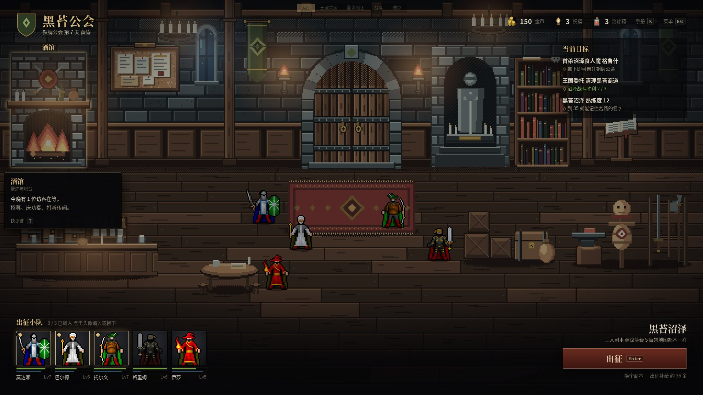
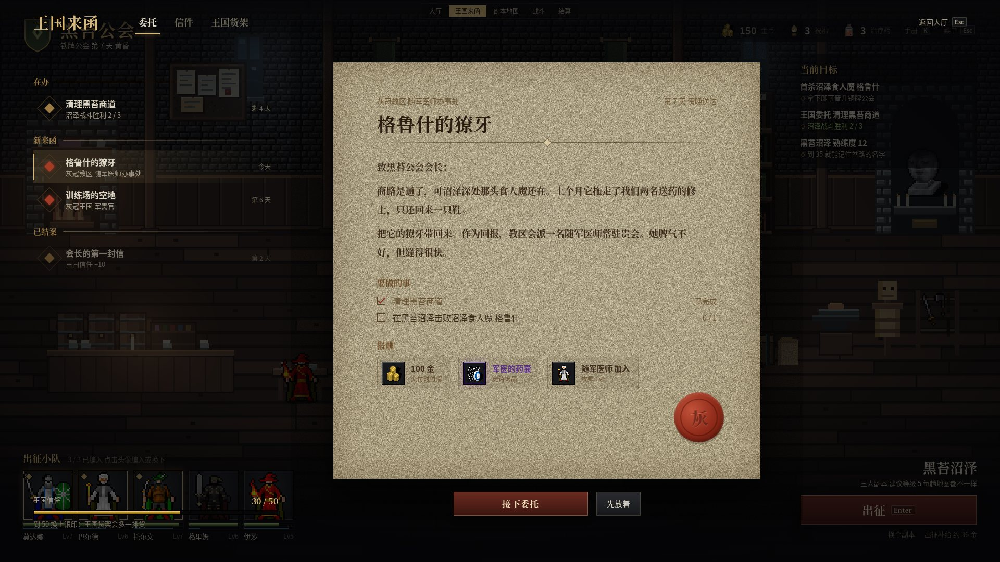
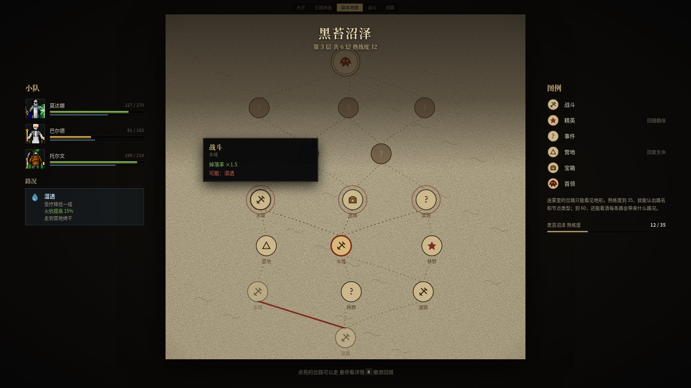
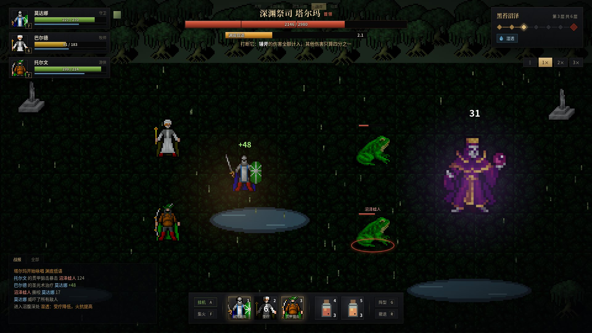
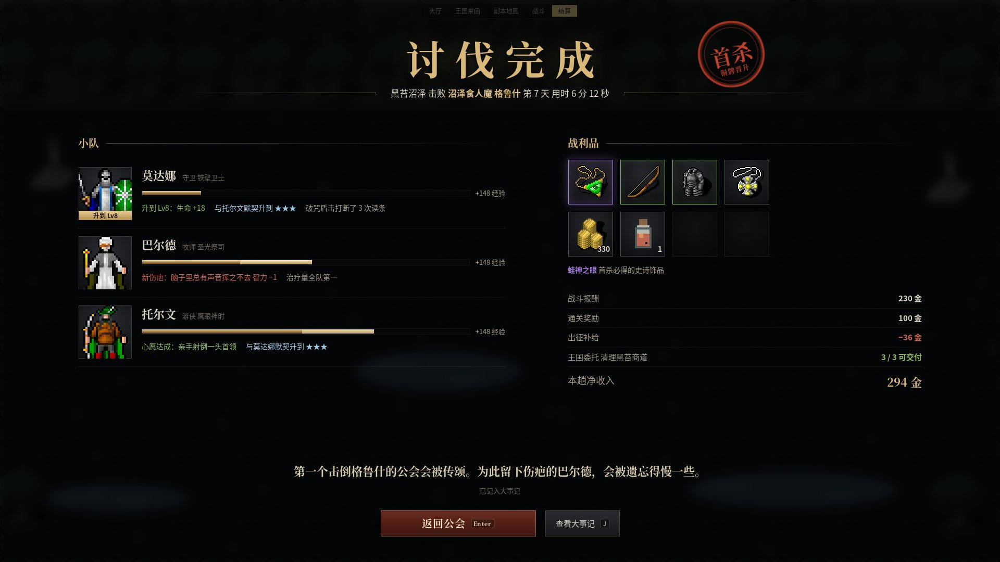
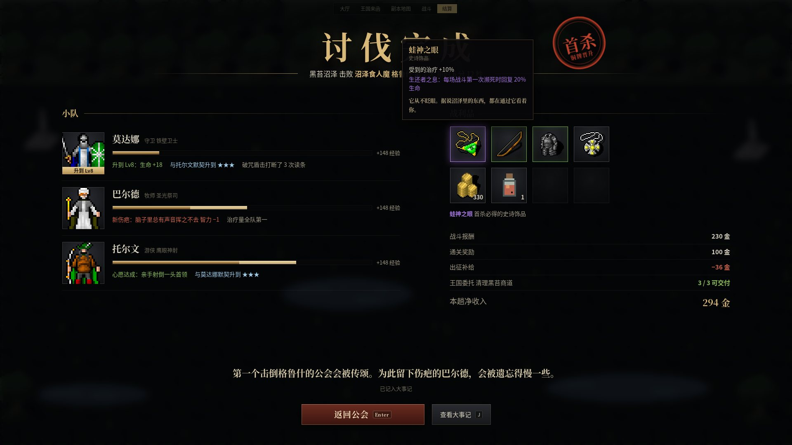

# 黑苔公会 Steam 版 UI 方案 v3(Claude,2026-10-08)

**地位**:方案建议,未批准施工(AGENTS:美术/UI 换皮须先问制作人)。
**版本沿革**:
- v1 整个界面压进 640×360 的像素格子,全局用像素字。被否:像手机游戏、太复古。
- v2 改为像素世界加高清界面。制作人认为方向可以,但仍有移动端味道。
- v3 不考虑手机端,按 Steam 桌面游戏的标准重做,新增副本地图和结算两屏。

**大厅美术已精修**(制作人 2026-10-08 指示):16 个物件全部重画,有受光面、背光面、接触阴影和材质细节(石缝、木纹、铁箍、火焰分层、书脊、金线地毯),只用锁定的 32 色。源文件与生成脚本在 [hall-art/](ui-desktop-2026-10-08/hall-art/),整图 3 倍预览见 [hall-art-3x.jpg](ui-desktop-2026-10-08/hall-art-3x.jpg)。施工时直接用这些 PNG,坐标在 `layout.json`。

**样稿**:[ui-desktop-mock-2026-10-08.html](ui-desktop-mock-2026-10-08.html),单文件,双击打开。顶部有一条半透明导航,可以在五屏之间切换。也能用键盘走完整条流程:Enter 出征,点亮的节点进入战斗,战斗里 Enter 进入结算,结算里 Enter 返回大厅,Q 打开王国来函,Esc 返回。

| 大厅 | 王国来函 |
|---|---|
|  |  |
| **副本地图** | **战斗** |
|  |  |
| **结算** | **结算 · 战利品悬停** |
|  |  |

现状对照:[大厅](ui-desktop-2026-10-08/before-hall.png)、[战斗(整页高 1421px,会滚动)](ui-desktop-2026-10-08/before-battle-full.png)、[地图](ui-desktop-2026-10-08/before-map.png)、[人物页](ui-desktop-2026-10-08/before-member.png)。

---

## 1. v2 为什么还有手游味,v3 改了什么

| v2 的问题 | 手游的特征 | v3 的改法 |
|---|---|---|
| 按 1280×720 设计,控件大,信息少 | 为手指和小屏设计的密度 | 按 **1920×1080** 设计。正文 15px,次要文字 13px,动作条格子 76px。留给世界的面积约占屏幕 70% |
| 圆角、渐变按钮、大色块 | 移动端 UI 套件的语言 | **直角黑铁底板加一道细金线**,只有大面板带角饰;主按钮全游戏只有一种暗红 |
| 每一样功能都是一块浮动卡片 | 卡片式布局 | 信息贴着屏幕边缘、沿渐隐的暗带排开(魔兽式),中间不放卡片 |
| 王国来函是一个滑出抽屉 | 移动端抽屉 | 改为**全屏日志**:左边委托列表加页签,中间是一封带火漆的信(巫师 3 式) |
| 地图和结算没有设计 | — | 新增**手绘卷轴地图**(杀戮尖塔式)和**讨伐完成结算**(怪物猎人式盖章 + 暗黑地牢式队员回顾) |

## 2. 参照:八款借鉴游戏各取一样

| 游戏 | 取什么 | 用在哪 |
|---|---|---|
| **魔兽世界** | 左上队伍框、首领框和读条条、底部动作条(冷却扫过、快捷键角标、就绪发光)、右侧任务追踪器、深色悬停说明 | 战斗 HUD、大厅目标、全局悬停框 |
| **巫师 3** | 任务日志:左侧列表按「在办 / 新来函 / 已结案」分组,右侧是叙事化的正文与目标清单;全屏打开,世界虚化在背后 | 王国来函 |
| **怪物猎人** | 「任务完成」的仪式感:大字横幅、印章、报酬分栏;首领是界面的主角 | 结算横幅与首杀印章 |
| **暗黑地牢** | 远征归来逐个回看队员:谁升级了、谁添了伤疤、谁和谁更默契;代价和收获同等醒目 | 结算的小队栏 |
| **杀戮尖塔** | 纸面上手绘的分层地图,节点图标一眼可辨,走过的路用墨线连起来,下一步可选节点会呼吸 | 副本地图 |
| **暗黑破坏神** | 装备格子按品质描边发光(绿 / 蓝 / 紫),悬停说明里有属性、特效和一句风味文字 | 结算战利品、仓库 |
| **矮人要塞** | 游戏区占满屏幕,功能面板叠在其上;以鼠标为主,快捷键作补充 | 整体框架 |
| **公会创世纪** | 直接竞品(Origin Studio,Steam 2026-09-14)。制作人提供的两张截图([1](ui-desktop-2026-10-08/ref-creator-chronicles-1.jpg)、[2](ui-desktop-2026-10-08/ref-creator-chronicles-2.jpg))显示:俯视像素城镇占满全屏;左侧一列队伍面板、右侧一列详情面板贴边;底部一条建造图标栏;界面是深棕像素框加小号像素字,信息密度高。**取**:世界占满、面板贴两侧、底栏放主操作,这和本方案一致,说明方向对。**不取**:它的界面层仍是低分辨率像素框和像素字,读起来偏复古;我们用高清字体、光照和黑铁细金线拉开档次 | 方向验证与差异化 |

另外两条设计哲学:

- 暗黑地牢的创意总监 Chris Bourassa 说过,美术和设计必须出自同一个创作意图,一致性是沉浸感的关键;还有,他们没有去追当时流行的像素风,而是选了最适合自己游戏的风格([RPS 访谈](https://www.rockpapershotgun.com/darkest-dungeon-making-of-art))。
- 杀戮尖塔的分类靠形状来表达,颜色只作装饰。这样即使信息很多,画面依然可读([Game Design Lab 分析](https://teemo.dev/game-design/slay-the-spire/systems/art-direction-and-visual-language/))。

v3 的节点图标、品质描边、路况标签都遵守这两条。

## 3. 设计系统

**两层分辨率**:

- **世界层**:32px 像素,只用锁定的黑苔 32 色(U24)。大厅放大 3 倍,战斗放大 4 倍。上面叠冷色环境光、暖色光源和暗角三层。
- **界面层**:按 1920×1080 设计,随窗口等比缩放。文字是矢量字体,放大不糊。

**字**:

- **思源宋体 Bold**:标题、名牌、首领名、来函正文、结算横幅、说书人故事。
- **思源黑体**:数据、说明、按钮次要文字。
- 两套字体按用途严格分开:读的用宋体,查的用黑体。
- 样稿按实际用到的字做了子集,三个字重合计约 780KB。

**界面色**(世界层不受此限):

| 名 | 值 | 用途 |
|---|---|---|
| 黑铁 | `rgba(22,23,27,.95)` 到 `rgba(11,12,14,.95)` | 所有底板 |
| 细金线 | `rgba(217,185,121,.16)` 内描边,强调处 `#9c7b45` | 底板边、分隔线、角饰 |
| 金 | `#d9b979` | 标题、选中、就绪 |
| 墨 | `#ddd6c4` / `#a49c88` / `#6e6858` | 正文三级 |
| 羊皮纸 | `#d8c9a3` 加噪点和焦边 | 只用于来函和地图,即「世界里的纸」 |
| 暗红 | `#6a2b20` 到 `#3b150f` | 唯一的主按钮:出征、接下委托、返回公会 |
| 品质 | 绿 `#6fae4a`、蓝 `#4f8fd0`、紫 `#a374de` | 只用于装备 |

**原则**:

- 世界占满屏幕,界面贴边。
- 只有两处是纸面:来函和地图,这是世界里本来就有的东西。其余都是黑铁。
- 说明文字只放在悬停框里,不常驻铺开。
- 动效只出现在三处:首领读条、下一步可选节点的呼吸、结算盖章与经验条增长。

## 4. 五个界面

| 界面 | 结构 | 要点 |
|---|---|---|
| **大厅** | 左上是公会纹章与天数;右上是资源细栏和任务追踪;左下是出征小队头像(96px,带生命条和精力条);右下是目的地、出征按钮、补给预估 | 设施都是房间里的物件,悬停显示名牌和说明。壁炉和火把会轻微闪动 |
| **王国来函** | 全屏日志。左侧委托列表分三组,附王国信任条;中间一封羊皮纸信:来源、标题、叙事正文、要做的事(打钩)、报酬(装备按品质描边)、火漆 | 「随军医师加入」这类人物奖励直接显示头像 |
| **副本地图** | 左侧小队状态与当前路况(好处、坏处、解除方式);中间卷轴地图;右侧图例与熟练度 | 迷雾压住前方三层,只露出地形;走过的路是红墨实线;下一步可选节点会呼吸;悬停显示「掉落率 ×1.5,可能湿透」这类取舍 |
| **战斗** | 左上队伍框;顶部首领框(含阶段刻度)和读条条,写明怎么打断;右上路线进度、路况、倍速;左下战报;底部动作条(挂机、集火、3 个招牌技、2 种药、阵型、撤退) | 场内只有目标圈、头顶血条和伤害飘字 |
| **结算** | 「讨伐完成」横幅加首杀印章(盖下来的动效);左侧逐个回顾队员(升级、经验条增长、伤疤、心愿、默契);右侧战利品格(品质描边)和收支明细;底部是说书人的一句话 | 代价(伤疤、补给支出)和收获同样醒目;团灭和撤退各用一套横幅文字 |

## 5. 施工包(建议顺序;人日只表示相对规模)

| 包 | 内容 | 规模 | 验收 |
|---|---|---|---|
| **D1 舞台与两层分辨率** | `GameViewport`:界面层按 1920×1080 设计并等比缩放,世界层整数倍渲染;禁止页面滚动;删掉页眉、限宽和响应式断点;Pixi 渲染器加光照三层 | 2 | 1920×1080 和 2560×1440 下都不滚动;世界像素锐利,文字清晰 |
| **D2 设计系统** | 合并 `index.css` 与 `art.css` 为一套 token(§3);思源宋体加思源黑体,按游戏文本做子集打包;定出底板、按钮、条、悬停框四个基础组件 | 1.5 | 没有 `Segoe UI`;没有圆角;字号只用规定档位 |
| **D3 战斗 HUD** | §4 的战斗布局;动作条接招牌技与药;场内高清层(目标圈、血条、飘字);删掉 `tick`;快捷键:空格、1–5、A、F、G、R、Tab、Esc | 2.5 | 一屏看全战场和全部操作,每个操作都有快捷键 |
| **D4 结算** | 替换现在的 ResultScreen:横幅、印章、队员回顾、战利品格、收支、说书人一句;另做团灭和撤退两套横幅 | 2 | 结算一屏放下,不滚动;伤疤和补给支出都可见 |
| **D5 副本地图** | MapScreen 改为卷轴:纸面、手绘连线、按形状区分的节点图标、迷雾、呼吸、悬停取舍 | 2 | 迷雾档位、路况提示与 R1.3 一致;熟练度 0 时不泄露节点类型(沿用现有 e2e 断言) |
| **D6 王国来函与日志框架** | 全屏日志组件(页签、分组列表、纸面正文),先用于王国来函,之后复用到大事记和手册 | 2 | 委托、信件、货架三个页签都能用 |
| **D7 大厅房间** | 大厅落进游戏:房间、物件、光源、名牌、出征小队、出征按钮 | 2.5 | 新档第一屏不靠说明文字就能找到出征 |
| **D8 收尾** | emoji 全部换成像素图标;原生控件(下拉框、折叠)改为自绘;界面音效;关闭右键菜单和文字选择;尊重 `prefers-reduced-motion` | 2 | 渲染文本里没有 emoji;DOM 里没有 `select` 和 `details` |

合计约 16.5 人日。建议先做 **D1 + D2 + D3 + D4**(约 8 人日)。战斗和结算是每趟都会看到的两屏,也是「像不像 Steam 游戏」最直接的判断依据。

**纪律**:每包只改表现,不改玩法和数值。不用付费素材(U24)。每包交付附 1920×1080 截图。

## 6. 需要制作人拍板

1. **方向**:黑铁细金线、宋体加黑体、魔兽式 HUD、巫师式日志、尖塔式卷轴地图、怪猎式结算。可以就照这个走吗?
2. **桌面打包**(Tauri):独立窗口、全屏、本地存档。上 Steam 迟早要做,建议放在 D1–D8 之后。

## 7. 交给 Codex 施工的方法

样稿是「像素级规格」,不是灵感图。施工方照着做,验收时用截图逐屏对比。

- **规格来源**:`ui-desktop-mock-2026-10-08.html` 里的 CSS 就是设计 token 和组件规格(颜色、字号、间距、描边、阴影、动效时长),直接搬进 `src/ui/` 的样式文件,不要重新发明。大厅美术用 `ui-desktop-2026-10-08/hall-art/` 里的 PNG 和 `layout.json`,不要重画。
- **验收方式**:每个包交付时,在 1920×1080 下截出同一屏,和本文的样稿截图并排放进交付记录。版式、颜色、字体与样稿明显不一致的,算未完成。
- **顺序**:D1 → D2 → D3 → D4 先做,交制作人看过再做其余。
- **不在范围**:玩法、数值、存档结构。样稿里的文案和数字是示意,接真实数据。
- **复审**:每包完成后由 Claude 或 zcode 截图复审一次。

## 参考来源

- [Dwarf Fortress: New UI Art(Steam 新闻,2020-08-13)](https://store.steampowered.com/news/app/975370/view/4639224265623959693)
- [There's Beautiful Art Even In The Darkest Dungeon(Rock Paper Shotgun,2015)](https://www.rockpapershotgun.com/darkest-dungeon-making-of-art)
- [Slay the Spire: Art Direction & Visual Language(Game Design Lab)](https://teemo.dev/game-design/slay-the-spire/systems/art-direction-and-visual-language/)
- [How Do Quest Rewards Work? Monster Hunter World(Game8)](https://game8.co/games/Monster-Hunter-World/archives/306257)
- [Fernando Forero: The Witcher 3 UI Visual Art](https://fernandoforeroart.com/the-witcher-3-the-ui-visual-art)(站点拒绝抓取,仅作索引)
- [Fernando Forero: Diablo IV User Interface Art](https://fernandoforeroart.com/diablo-iv-user-interface-art)(同上)
- [公会创世纪 Steam 商店页](https://store.steampowered.com/app/3947460/)

- 公会创世纪截图:制作人提供,2026-10-08
- [B 站《公会创世纪》演示版试玩](https://www.bilibili.com/video/BV1rAJ9zUEF1/)(视频无法由 Claude 直接观看,仅作索引)
